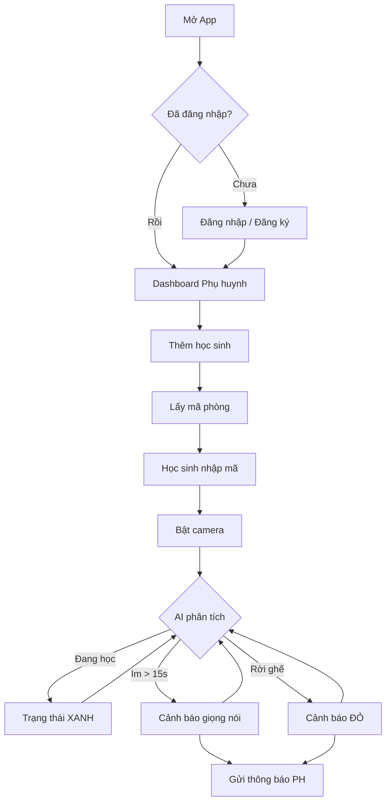

# 🎨 DESIGN: StudyGuard - App Giám Sát Học Sinh Tự Học

Ngày tạo: 23/03/2026
Dựa trên: [SPECS](file:///C:/Users/Admin/Desktop/UngdungRenTuHocChoHocSinh/docs/specs/studyguard_spec.md)

---

## 1. Cách Lưu Thông Tin (Database)

> 💡 App lưu trữ thông tin giống như các sheet Excel. Mỗi bảng = 1 sheet.

### Sơ đồ tổng quan:

```
┌──────────────────────────┐
│  👤 USERS (Phụ huynh)    │
│  ├── Tên đăng nhập       │
│  ├── Mật khẩu (mã hóa)  │
│  └── Tên hiển thị        │
└──────────┬───────────────┘
           │ 1 phụ huynh có nhiều học sinh
           ▼
┌──────────────────────────┐
│  👦 STUDENTS (Học sinh)  │
│  ├── Tên                 │
│  └── Mã phòng (6 ký tự) │
└──────────┬───────────────┘
           │ 1 học sinh có nhiều buổi học
           ▼
┌──────────────────────────┐
│  📚 SESSIONS (Buổi học)  │
│  ├── Giờ bắt đầu        │
│  ├── Giờ kết thúc        │
│  ├── Tổng giây tập trung │
│  └── Số lần vi phạm     │
└──────────┬───────────────┘
           │ 1 buổi học có nhiều vi phạm
           ▼
┌──────────────────────────┐
│  ⚠️ VIOLATIONS (Vi phạm) │
│  ├── Loại (mất tập trung │
│  │   / không học)         │
│  ├── Thời điểm           │
│  └── Thời lượng (giây)   │
└──────────────────────────┘
```

### Chi tiết SQL:

```sql
-- Bảng phụ huynh
CREATE TABLE users (
    id INTEGER PRIMARY KEY AUTOINCREMENT,
    username TEXT UNIQUE NOT NULL,
    password_hash TEXT NOT NULL,
    display_name TEXT NOT NULL,
    created_at DATETIME DEFAULT CURRENT_TIMESTAMP
);

-- Bảng học sinh
CREATE TABLE students (
    id INTEGER PRIMARY KEY AUTOINCREMENT,
    parent_id INTEGER NOT NULL,
    name TEXT NOT NULL,
    room_code TEXT UNIQUE NOT NULL,  -- Mã 6 ký tự: ABC123
    avatar_color TEXT DEFAULT '#4CAF50',
    created_at DATETIME DEFAULT CURRENT_TIMESTAMP,
    FOREIGN KEY (parent_id) REFERENCES users(id)
);

-- Bảng buổi học
CREATE TABLE study_sessions (
    id INTEGER PRIMARY KEY AUTOINCREMENT,
    student_id INTEGER NOT NULL,
    start_time DATETIME NOT NULL,
    end_time DATETIME,
    total_focus_seconds INTEGER DEFAULT 0,
    total_distracted_seconds INTEGER DEFAULT 0,
    total_not_studying_seconds INTEGER DEFAULT 0,
    violation_count INTEGER DEFAULT 0,
    status TEXT DEFAULT 'active',  -- 'active' | 'completed'
    FOREIGN KEY (student_id) REFERENCES students(id)
);

-- Bảng vi phạm
CREATE TABLE violations (
    id INTEGER PRIMARY KEY AUTOINCREMENT,
    session_id INTEGER NOT NULL,
    type TEXT NOT NULL,  -- 'distracted' | 'not_studying'
    started_at DATETIME NOT NULL,
    duration_seconds INTEGER DEFAULT 0,
    FOREIGN KEY (session_id) REFERENCES study_sessions(id)
);
```

---

## 2. Danh Sách Màn Hình

| # | Tên | Mục đích | Ai dùng |
|---|-----|----------|---------|
| 1 | Landing Page | Giới thiệu app + Đăng nhập/Đăng ký | Tất cả |
| 2 | Đăng ký | Tạo tài khoản phụ huynh | Phụ huynh |
| 3 | Đăng nhập | Vào hệ thống | Phụ huynh |
| 4 | Dashboard PH | Xem tổng quan con cái | Phụ huynh |
| 5 | Chi tiết buổi học | Xem timeline real-time | Phụ huynh |
| 6 | Nhập mã phòng | Học sinh nhập mã để vào | Học sinh |
| 7 | Màn hình học tập | Camera + AI + cảnh báo | Học sinh |

---

## 3. Thiết Kế API (Các "Cửa" để app nói chuyện với server)

### 3.1. Authentication APIs

| Hành động | Phương thức | Đường dẫn | Gửi đi | Nhận về |
|-----------|-------------|-----------|--------|---------|
| Đăng ký | POST | `/api/auth/register` | username, password, display_name | { success, message } |
| Đăng nhập | POST | `/api/auth/login` | username, password | { success, user } |
| Đăng xuất | POST | `/api/auth/logout` | (nothing) | { success } |
| Kiểm tra đã login | GET | `/api/auth/me` | (nothing) | { user } hoặc 401 |

### 3.2. Student APIs

| Hành động | Phương thức | Đường dẫn | Gửi đi | Nhận về |
|-----------|-------------|-----------|--------|---------|
| Danh sách HS | GET | `/api/students` | (nothing) | [{ id, name, room_code, status }] |
| Thêm HS | POST | `/api/students` | name | { student, room_code } |
| Xóa HS | DELETE | `/api/students/:id` | (nothing) | { success } |
| Vào phòng (HS) | POST | `/api/room/join` | room_code | { success, student_name } |

### 3.3. Session APIs

| Hành động | Phương thức | Đường dẫn | Gửi đi | Nhận về |
|-----------|-------------|-----------|--------|---------|
| Buổi học hiện tại | GET | `/api/sessions/active/:studentId` | (nothing) | { session } |
| Lịch sử buổi học | GET | `/api/sessions/:studentId` | (nothing) | [{ sessions }] |
| Thống kê hôm nay | GET | `/api/stats/today` | (nothing) | { total_time, violations, focus% } |

### 3.4. WebSocket Events

```
── TỪ HỌC SINH → SERVER ──────────────────────────
session:start     { room_code }
session:end       { room_code, summary }
status:update     { room_code, state, timestamp }
                  state = 'studying' | 'distracted' | 'not_studying'
violation:new     { room_code, type, timestamp }

── TỪ SERVER → PHỤ HUYNH ─────────────────────────
student:online    { student_id, student_name }
student:offline   { student_id }
status:changed    { student_id, state, timestamp }
violation:alert   { student_id, student_name, type, timestamp }
session:summary   { student_id, summary }
```

---

## 4. Luồng Hoạt Động

### 📍 Hành trình 1: Phụ huynh lần đầu dùng app

```
1️⃣ Mở app → Thấy Landing Page (giới thiệu app)
2️⃣ Bấm "Đăng ký" → Nhập tên, username, password
3️⃣ Đăng ký thành công → Tự động đăng nhập
4️⃣ Vào Dashboard (trống) → Bấm "Thêm học sinh"
5️⃣ Nhập tên con → Hệ thống tạo mã phòng (VD: ABC123)
6️⃣ Thấy mã phòng → Đưa cho con nhập trên điện thoại con
```

### 📍 Hành trình 2: Học sinh bắt đầu học

```
1️⃣ Mở web trên điện thoại → Thấy trang nhập mã
2️⃣ Nhập mã phòng ABC123 → Bấm "Bắt đầu học"
3️⃣ Cho phép camera → Camera bật, AI bắt đầu phân tích
4️⃣ Ngồi học bình thường → Thanh trạng thái XANH
5️⃣ Ngừng viết 15 giây → Nhắc nhở "Em hãy học bài thật chăm chỉ"
6️⃣ Tiếp tục viết → Thanh quay lại XANH
7️⃣ Bấm "Kết thúc" → Hiện tóm tắt buổi học
```

### 📍 Hành trình 3: Phụ huynh giám sát từ xa

```
1️⃣ Đăng nhập → Dashboard hiện danh sách con
2️⃣ Con bật camera → Card chuyển "🟢 Đang học"
3️⃣ Con mất tập trung → 🔔 Popup "Minh đang mất tập trung!"
4️⃣ Bấm vào card → Xem chi tiết (timeline sự kiện)
5️⃣ Con kết thúc → Card chuyển "⚫ Offline" + hiện summary
```

### Sơ đồ luồng (Mermaid):



---

## 5. Thiết Kế AI Camera Engine

### 5.1. Thư viện sử dụng

```
MediaPipe Pose Landmarker (chạy trên browser)
├── Input: Video stream từ camera
├── Output: 33 keypoints (tọa độ x, y, z + visibility)
└── FPS: 15-30 trên điện thoại trung bình
```

### 5.2. Keypoints quan trọng

| # | Keypoint | Dùng để |
|---|----------|---------|
| 0 | Nose | Hướng đầu (cúi/ngẩng) |
| 11 | Left Shoulder | Xác nhận có người |
| 12 | Right Shoulder | Xác nhận có người |
| 15 | Left Wrist | Phát hiện tay viết |
| 16 | Right Wrist | Phát hiện tay viết |

### 5.3. Thuật toán phân loại

```javascript
// Pseudocode - Logic phân loại trạng thái

function classifyBehavior(currentPose, previousPoses) {
    // 1. Kiểm tra có người không
    if (!isBodyVisible(currentPose)) {
        return 'NOT_STUDYING';  // Rời ghế / quay lưng
    }

    // 2. Kiểm tra đầu có cúi không (đang nhìn xuống bàn)
    const headDown = isHeadDown(currentPose);
    // nose.y > shoulder_midpoint.y (trong tọa độ camera, y tăng xuống dưới)

    // 3. Kiểm tra tay có chuyển động không
    const handMoving = isHandMoving(currentPose, previousPoses);
    // Tính delta vị trí wrist qua 10 frame gần nhất

    // 4. Phân loại
    if (headDown && handMoving) {
        return 'STUDYING';      // Đầu cúi + tay viết = Đang học
    }

    // 5. Kiểm tra thời gian idle
    if (idleTimer > 15_SECONDS) {
        return 'DISTRACTED';    // Im quá 15 giây
    }

    return 'STUDYING';          // Mặc định = đang học (ưu tiên tích cực)
}
```

### 5.4. State Machine (Chống nhấp nháy)

```
STUDYING ──(idle > 15s)──> DISTRACTED ──(idle > 30s)──> NOT_STUDYING
    ▲                          │                              │
    └──(hand moves)────────────┘                              │
    └──(body visible + moves)─────────────────────────────────┘
    
Debounce: Mỗi trạng thái phải giữ ít nhất 3 giây trước khi chuyển
```

---

## 6. Thiết Kế Cảnh Báo

### 6.1. Cảnh báo giọng nói (Web Speech API)

```javascript
// Phát giọng tiếng Việt
const utterance = new SpeechSynthesisUtterance('Em hãy học bài thật chăm chỉ');
utterance.lang = 'vi-VN';
utterance.rate = 0.9;  // Hơi chậm để nghe rõ
window.speechSynthesis.speak(utterance);
```

**Quy tắc phát cảnh báo:**
- Không phát liên tục (cooldown 30 giây giữa 2 lần)
- Phát tối đa 3 lần liên tiếp, sau đó nghỉ 2 phút
- Âm lượng tăng dần theo số lần vi phạm

### 6.2. Cảnh báo hình ảnh

| Trạng thái | Màu viền | Animation |
|------------|----------|-----------|
| STUDYING | 🟢 Xanh lá (#4CAF50) | Không |
| DISTRACTED | 🟡 Vàng (#FFC107) | Pulse nhẹ |
| NOT_STUDYING | 🔴 Đỏ (#F44336) | Nhấp nháy mạnh |

---

## 7. Checklist Kiểm Tra

### ✅ Tính năng: Đăng ký / Đăng nhập

| # | Test Case | Kết quả mong đợi |
|---|-----------|-------------------|
| TC-01 | Đăng ký với đầy đủ thông tin | Tạo tài khoản thành công, vào Dashboard |
| TC-02 | Đăng ký trùng username | Báo lỗi "Tên đăng nhập đã tồn tại" |
| TC-03 | Đăng ký với password < 6 ký tự | Báo lỗi "Mật khẩu phải ít nhất 6 ký tự" |
| TC-04 | Đăng nhập đúng | Vào Dashboard |
| TC-05 | Đăng nhập sai password | Báo lỗi |

### ✅ Tính năng: Quản lý học sinh

| # | Test Case | Kết quả mong đợi |
|---|-----------|-------------------|
| TC-06 | Thêm học sinh mới | Hiện mã phòng 6 ký tự |
| TC-07 | Nhập mã phòng đúng | Vào phòng học, bật camera |
| TC-08 | Nhập mã phòng sai | Báo lỗi "Mã phòng không tồn tại" |

### ✅ Tính năng: AI Camera

| # | Test Case | Kết quả mong đợi |
|---|-----------|-------------------|
| TC-09 | Ngồi viết bài (đầu cúi + tay di chuyển) | Trạng thái XANH |
| TC-10 | Ngồi im > 15 giây | Chuyển VÀNG + phát giọng nhắc nhở |
| TC-11 | Rời ghế / quay lưng | Chuyển ĐỎ + phát cảnh báo mạnh |
| TC-12 | Viết lại sau khi bị cảnh báo | Quay về XANH trong 3 giây |
| TC-13 | Camera permission denied | Hiện hướng dẫn bật camera |
| TC-14 | Ánh sáng yếu / không thấy pose | Hiện "Vui lòng bật đèn" |

### ✅ Tính năng: Real-time & Thông báo

| # | Test Case | Kết quả mong đợi |
|---|-----------|-------------------|
| TC-15 | HS bật camera | PH Dashboard hiện "🟢 Online" |
| TC-16 | HS vi phạm | PH nhận notification trong 2 giây |
| TC-17 | HS kết thúc buổi học | PH thấy summary (thời gian, vi phạm, %) |
| TC-18 | Mất mạng + nối lại | Tự reconnect, data không mất |

---

## 8. Cấu Trúc Folder Dự Án

```
UngdungRenTuHocChoHocSinh/
├── docs/
│   ├── BRIEF.md
│   ├── DESIGN.md          ← File này
│   └── specs/
│       └── studyguard_spec.md
├── plans/
│   └── 260323-1222-studyguard/
│       ├── plan.md
│       └── phase-01..07
├── src/
│   ├── server/
│   │   ├── server.js          # Express + Socket.io server
│   │   ├── db.js              # SQLite setup + queries
│   │   ├── socket.js          # WebSocket event handlers
│   │   ├── middleware/
│   │   │   └── auth.js        # Auth middleware
│   │   └── routes/
│   │       ├── auth.js        # Register/Login/Logout
│   │       ├── students.js    # CRUD học sinh
│   │       └── sessions.js    # Study session data
│   └── public/
│       ├── index.html         # Landing page
│       ├── register.html      # Đăng ký
│       ├── login.html         # Đăng nhập
│       ├── dashboard.html     # Dashboard phụ huynh
│       ├── student.html       # Màn hình học sinh
│       ├── css/
│       │   ├── common.css     # Style chung
│       │   ├── landing.css    # Landing page style
│       │   ├── auth.css       # Đăng ký/Đăng nhập
│       │   ├── dashboard.css  # Dashboard
│       │   └── student.css    # Màn hình học sinh + AI
│       ├── js/
│       │   ├── auth.js        # Client auth logic
│       │   ├── dashboard.js   # Dashboard logic
│       │   ├── student.js     # Student page logic
│       │   ├── camera.js      # Camera management
│       │   ├── poseDetector.js    # MediaPipe integration
│       │   ├── behaviorAnalyzer.js # Behavior classification
│       │   ├── stateMachine.js    # State management
│       │   ├── voiceAlert.js      # Voice alerts
│       │   ├── studentSocket.js   # Student WebSocket
│       │   ├── parentSocket.js    # Parent WebSocket
│       │   └── notification.js    # Notification UI
│       └── assets/
│           └── logo.png       # App logo
├── package.json
├── .env.example
└── .gitignore
```

---

*Tạo bởi AWF - Design Phase | 23/03/2026*
